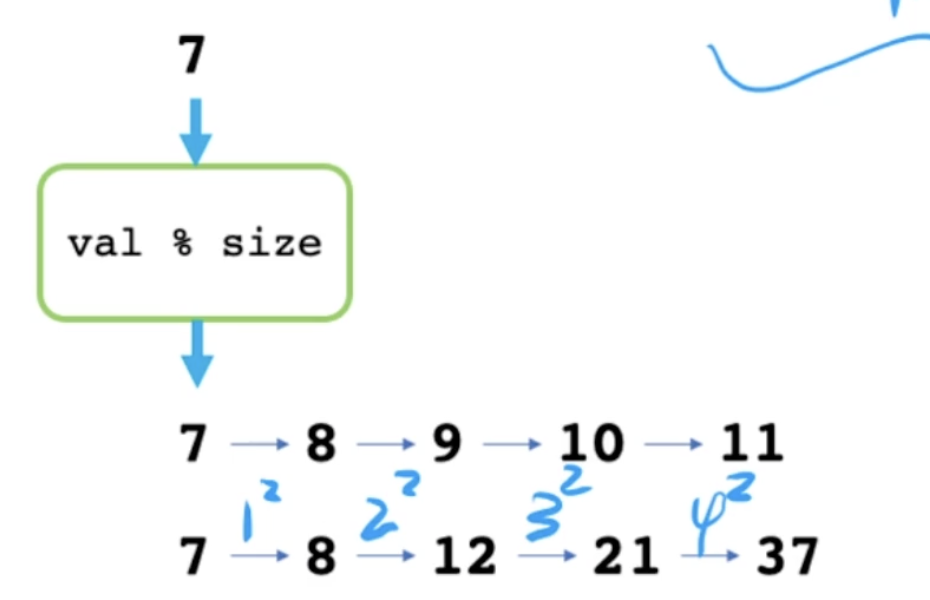

# 哈希 & 布隆过滤器

## 哈希表

时间复杂度：O(1)

哈希：从高维空间到低维空间的映射，一定会发生哈希冲突

哈希函数：映射关系

哈希冲突：多个元素映射到同一个位置

**解决冲突方法：**

* 开放定址法(设计感极强)：如果映射位置被占，则重新计算

  如下图：根据哈希函数映射的位置已经被占用，则基于当前位置重新计算新位置（添加整数的平方）

  

* 再哈希法

* 建立公共溢出区: 建立公共溢出区

* 链式地址法（拉链法）：存储的是一个链表的头节点


**代码演示**

开放定值法

```c++
// 定义一个hash表处理方法
class HashTable {
  public: 
  	HashTable(int n = 100): flag(n), data(n), cnt(0){}
  	void insert(string s) {
      int ind = hash_func(s) % data.size(); // 哈希函数，计算哈希值
      recalc_ind(ind, s); // 冲突处理方法
      if(flag[ind] == false) {
        data[ind] = s;
        flag[ind] = true;
        cnt += 1;
        if(cnt * 100 > data.size() * 75) {
          expand();
        }
      }
      return;
    }
  	bool find(string s) {
      int ind = hash_func(s) % data.size();
      recalc_ind(ind, s);
      return flag[ind];
    }
  
  private:
  	int cnt;
  	vector<string> data;
  	// 记录每个位置是否存储数据
  	vector<bool> flag;
  	// hash 扩容；
  	void expand() {
      int n = data.size() * 2;
      HashTable h(n);
      for (int i = 0; i < data.size(); i++) {
        if(flag[i] == false) continue;
        h.insert(data[i]);
      }
      *this = h;
      return;
    }
  	// 字符串返回一个整型 BKDRhash
  	int hash_func(string &s) {
      int seed = 131, hash = 0;
      for(int i = 0; s[i]; i++) {
				hash = hash * seed + s[i];
      }
			return hash & 0x7fffffff;
    }
  	void recalc_ind(int &ind, string &s) {
      // 开放定值法
      int t = 1;
      while(flag[ind]==1 && data[ind] 1= s) {
        ind += t * t;
        t += 1;
        ind %= data.size();
      }
      return;
    }
}

int main() {
  int op;
  string s; 
  HashTable h;
  while(cin >> op >> s){
    switch(op) {
      case 1: 
        insert(s);
    		break;
      case 2:
        find(s);
        break;
    }
  }
}
```

公共缓存区

```c++
class HashTable {
  public: 
  	HashTable(int n = 100): flag(n), data(n), cnt(0){}
  	void insert(string s) {
      int ind = hash_func(s) % data.size(); // 哈希函数，计算哈希值
      recalc_ind(ind, s); // 冲突处理方法
      data[ind] = s;
      flag[ind] = true;
      return;
    }
  	bool find(string s) {
      int ind = hash_func(s) % data.size();
      recalc_ind(ind, s);
      return flag[ind];
    }
  
  private:
  	int cnt;
  	vector<string> data;
  	// 记录每个位置是否存储数据
  	vector<bool> flag;
  	set<string> buff;
  	// hash 扩容；
  	void expand() {
      int n = data.size() * 2;
      HashTable h(n);
      for (int i = 0; i < data.size(); i++) {
        if(flag[i] == false) continue;
        h.insert(data[i]);
      }
      *this = h;
      return;
    }
  	// 字符串返回一个整型 BKDRhash
  	int hash_func(string &s) {
      int seed = 131, hash = 0;
      for(int i = 0; s[i]; i++) {
				hash = hash * seed + s[i];
      }
			return hash & 0x7fffffff;
    }
  	void recalc_ind(int &ind, string &s) {
      return ;
    }
}
```

