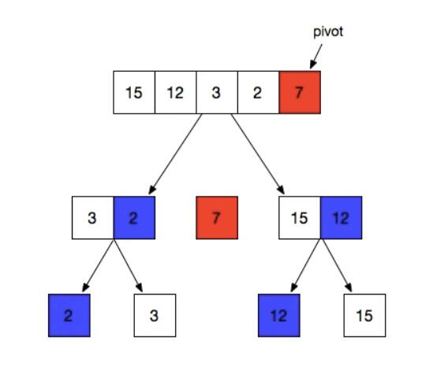

# 快速排序

数组长度为n： 排序有 n! 种

**分区思想 partition**

* 选取一个基准值
* 比较小于pivot放左边，大于放右边
* 分区递归遍历



**quick_sort_v1 版本**

``` c++
// quick_sort_v1
void quick_sort_v1(init *arr, int l, int r) {
	if(l >= r) return;
    int x = l, y = r, base = arr[l];
    while(x < y) {
        while(x < y && arr[y] >= base) y--;
        if(x < y) arr[x++] = arr[y];
        while(x < y && arr[x] < base) x++;
        if(x < y) arr[y--] = arr[x]
    }
    arr[x] = base;
    quick_sort_v1(arr, l, x-1);
    quick_sort_v1(arr, x+1, r);
    return;
}
```

为什么排序算法重要？

问题系统熵决定了一个问题被解决的难易程度。

降低熵的大小


## 从 C++ STL学习快速排序

* 单边递归法
* 无监督partition方法
* 三点取中法
* 小数据规模，停止快排过程
* 使用插入排序进行首尾

堆排序：nlogn ，比快排稳定

快速排序：nlogn 有时可以是 n^2，最好情况logn

插入排序：平均复杂度 n^2

内省排序（introsort）：这个排序算法首先从[快速排序](https://baike.baidu.com/item/快速排序)开始，当递归深度超过一定深度(大于2logn)（深度为排序元素数量的对数值）后转为[堆排序](https://baike.baidu.com/item/堆排序)。

| 排序类型 | 平均情况 | 最好情况 | 最坏情况 | 辅助空间 | 稳定性 |
| -------- | -------- | -------- | -------- | -------- | ------ |
| 快速排序 | O(nlogn) | O(nlogn) | O(n²)    | O(nlogn) | 不稳定 |
| 堆排序   | O(nlogn) | O(nlogn) | O(nlogn) | O(n)     | 稳定   |
| 插入排序 | O(n²)    | O(n)     | O(n²)    | O(1)     | 稳定   |

```c++
// quick_sort_v2  单边递归-左递归法
void quick_sort_v2(init *arr, int l, int r) {
	while(l < r) {
        int x = l, y = r, base = arr[l];
        while(x < y) {
            while(x < y && arr[y] >= base) y--;
            if(x < y) arr[x++] = arr[y];
            while(x < y && arr[x] < base) x++;
            if(x < y) arr[y--] = arr[x]
        }
        arr[x] = base;
        quick_sort_v2(arr, x+1, r);
        r = x - 1
    }
    return;
}
```

partition优化 ， 三点取中间 ： first , (last-first)/2 , last 取中间值

```c++
// quick_sort_v3
// 定义基准值，2^4 命中cpu优化（缓存）
const threshold = 16; 

// 获取中间值
inline int getmid(int a, int b, int c) {
	if(a > b) swap(a, b);
    if(a > c) swap(a, c);
    if(b > c) swap(b, c);
    return b;
}

void __quick_sort_v3(init *arr, int l, int r) {
	while(r - l > threshold) {
        int x = l, y = r, base = getmid(arr[l], arr[(l+r)/2], arr[r]);
        do {
            while(arr[x] < base) x++;
            while(arr[y] > base) y--;
            if(x <= y) {
				swap(arr[x], arr[y]);
                x++, y--;
            }
        } while(x <= y);
        __quick_sort_v3(arr, x, y);
        r = y;
    }
    return;
}

// 插入排序
void final_insert_sort(int *arr, int l, int r) {
    int ind = l;
    for(int i = l + 1; i <= r; i++) {
		if(arr[i] < arr[ind]) ind = i;
        while(ind > l) {
            swap(arr[ind], arr[ind - 1]);
            ind--;
        }
        for(int i = l + 2; i <= r; i++) {
            int j = i;
            while(arr[j] < arr[j - 1]) {
                swap(arr[j], arr[j - 1]);
                j--;
            }
        }
    }
}

void quick_sort_v3(int *arr, int l, int r) {
    __quick_sort_v3(arr, l, r);
    final_insert_sort(arr, l, r)
}
```

